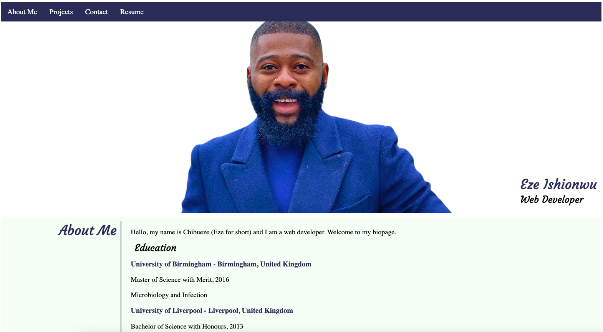

# Portfolio Rebuild - The Repository

This repository is where most of my projects for the DTTP Web Development course is stored. I will update the repository often with new projects as they come.

## Projects

The projects are also accessible via hyperlinks in the projects section of the portfolio page.

### Portfolio Rebuild

This was my main portfolio page project. In this project, I showed advanced CSS styling by implementing CSS in various ways including:

* Mobile Responsiveness (Media Queries),
* CSS Positioning and Layout,
* Utilization of CSS Grid and
* CSS Variables. 

The inclusion of this basic README.md document was also a requirement.

Here is a screenshot of my portfolio page:

    

[You can also visit GitHub Pages to view a live version of my portfolio page.](https://chibuezeishionwu.github.io/PortfolioRebuild/)

### Web APIs - Code Quiz

In this project, I used advanced JavaScript techniques to build a timed quiz that saves the highscore after the user is done with the quiz. Some of the JavaScript techniques used included:

* Timeouts and Intervals
* Managing the DOM via the JS Web API
* Creating and using functions
* Accessing the local storage
* Creating and using event listeners

Here is a preview of the quiz:

    

[Take the quiz if you're up for it!](./assets/code-quiz/code-quiz.html)

### Password Generator

In this project, I used advanced JavaScript techniques to create a random password generator that takes users preferences and generates a password based on those preferences. The password generator also includes a functional copy button. Below are some of the JavaScript techniques used in this project:

* JavaScript Arrays
* JavaScript Loops
* Creating and using functions
* Math object's random method
* Creating and using event listeners
* Copy function

Here is a screenshot of the password generator:

    

[Use this link if you need a new password or ten!](./assets/password-generator/password-generator.html)

## Technologies Used

All the code in this repository was edited using Microsoft's Visual Studio Code Editor (VS Code).

## License

[MIT](https://choosealicense.com/licenses/mit/)
