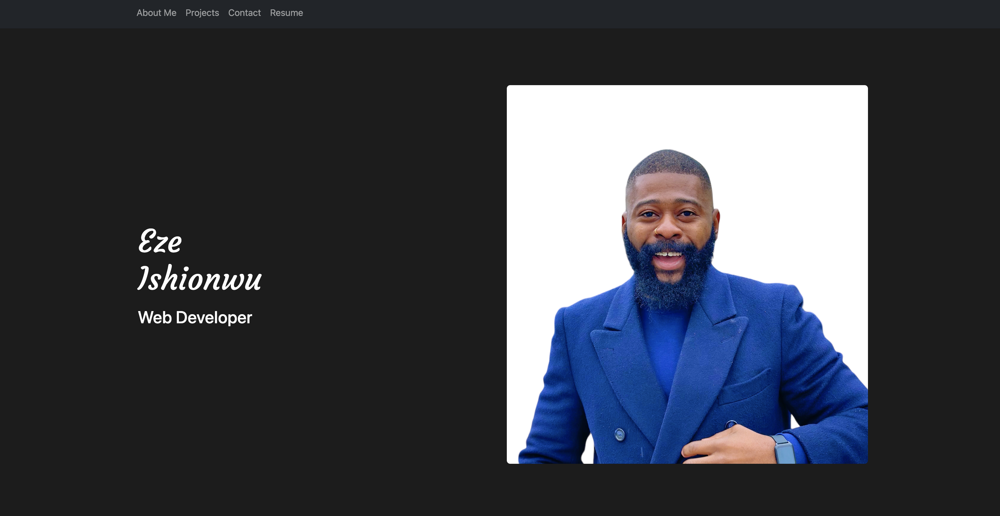
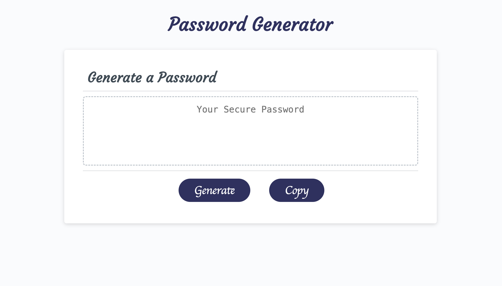

# Portfolio Rebuild - The Repository

This is a repository for my projects in the DTTP Web Development course. I will update the repository regularly.

## Projects

The projects listed here are also accessible via hyperlinks in the projects section of the portfolio page.

### Portfolio Rebuild

This is my portfolio page project. In this iteration of the project, I showed my progress as a web developer by implementing: 

* HTML
* CSS 
* JavaScript
* JQuery
* Web APIs and 
* External APIs

To acheive a professional look that shows:

* Responsiveness
* Advanced CSS Positioning and Layout
* Polished appearance
* Interactivity and
* Previous projects

Here is a screenshot of my portfolio page:

    

[Visit GitHub Pages to view a live version of my portfolio page.](https://chibuezeishionwu.github.io/PortfolioRebuild/)

### Task Board

In this project, I created a simple task board application that allows a team to manage project tasks by modifying starter code. This app runs in the browser and features dynamically updated HTML and CSS powered by JQuery. Below are some of the techniques used in this project:

* Third-party APIs such as:
    * jQuery
    * Day.js library
    * Bootstrap
* Creating and using functions
* Accessing the local storage
* Creating and using event listeners

Here is a preview of the task board:

    

[Follow this link to view the task board.](https://chibuezeishionwu.github.io/PortfolioRebuild/assets/task-board/task-board.html)

### Web APIs - Code Quiz

In this project, I used advanced JavaScript techniques to build a timed quiz that saves the high score after the user has completed the quiz. Some of the JavaScript techniques used included:

* Timeouts and Intervals
* Managing the DOM via the JS Web API
* Creating and using functions
* Accessing the local storage
* Creating and using event listeners

Here is a preview of the quiz:

    

[Take the quiz if you're up for it!](https://chibuezeishionwu.github.io/PortfolioRebuild/assets/code-quiz/code-quiz.html)

### Password Generator

In this project, I used advanced JavaScript techniques to create a random password generator that takes users' preferences and generates a password based on those preferences. The password generator also includes a functional copy button. Below are some of the JavaScript techniques used in this project:

* JavaScript Arrays
* JavaScript Loops
* Creating and using functions
* Math object's random method
* Creating and using event listeners
* Copy function

Here is a screenshot of the password generator:

    

[Use this link if you need a new password or ten!](https://chibuezeishionwu.github.io/PortfolioRebuild/assets/password-generator/password-generator.html)

## Technologies Used

All the code in this repository was edited using Microsoft's Visual Studio Code Editor (VS Code). The GitHub repository was managed using Apple MacBook's Terminal Application

## License

[MIT](https://choosealicense.com/licenses/mit/)
